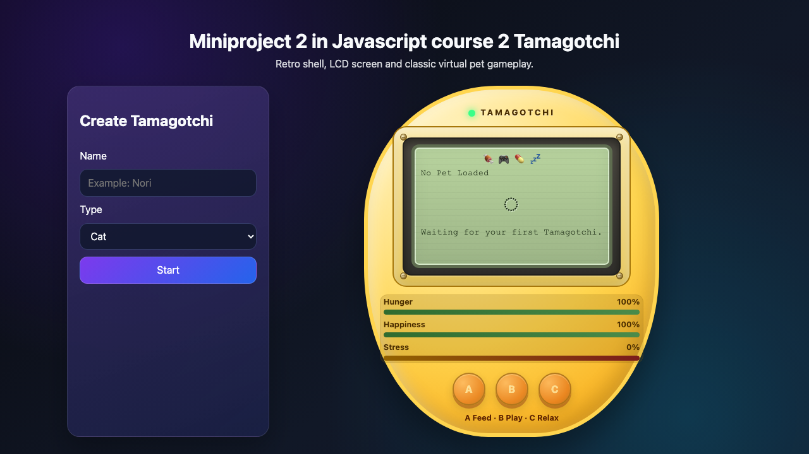

# Miniproject 2 in Javascript course 2 Tamagotchi

This repository started as a school project in the **Javascript 2** course.

Today, **2026-05-28**, the project was updated to a modern app stack while keeping the original Tamagotchi idea and gameplay.

## Live Preview

Deployed on Netlify: <https://friendly-piroshki-56ad1d.netlify.app>

## Screenshot



## Tech Stack

- React 18
- Vite 5
- Modern CSS animations and responsive, device-inspired UI

## What Was Updated

- Migrated from plain DOM scripts to a component-based React app.
- Redesigned the UI to look like a physical Tamagotchi device with embedded screen, controls, and status panel.
- Added improved game loop/state handling with clearer mood transitions and action feedback.
- Kept the original project spirit while modernizing structure, maintainability, and UX.

## Local Development

```bash
npm install
npm run dev
```

## Build

```bash
npm run build
```
